[My Github URL](https://github.com/zihyinhsu/1131-sweb-demo-22)
### W07-P1: W07-P1: Test css and js for w07.html
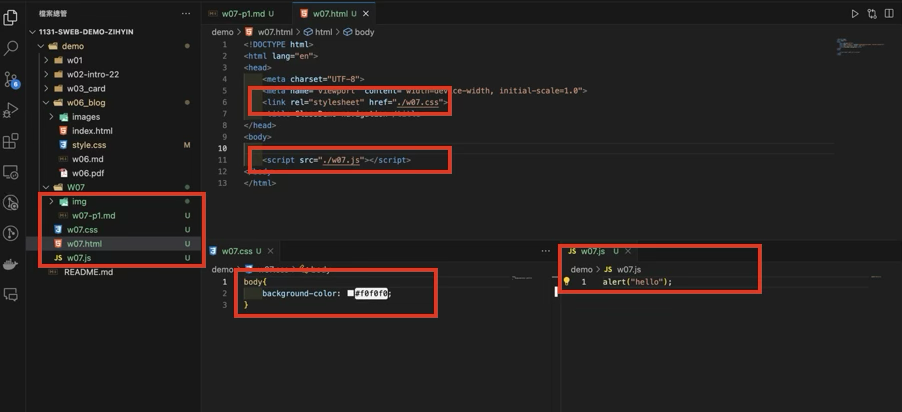
```
d0089b9 Zihyin  Thu Oct 24 19:17:42 2024 +0800  W07-P1: W07-P1: Test css and js for w07.html
```

### W07-P2: Redo W06-P4 with breakpoints being cancelled
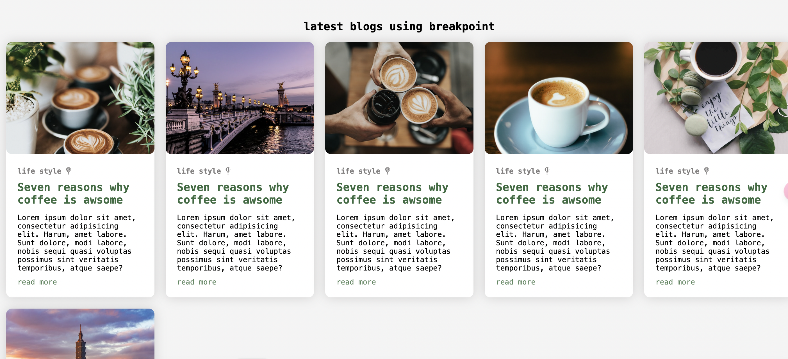
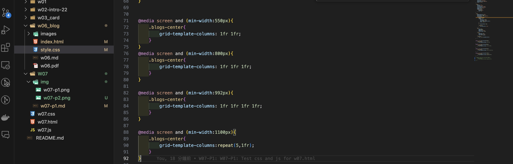
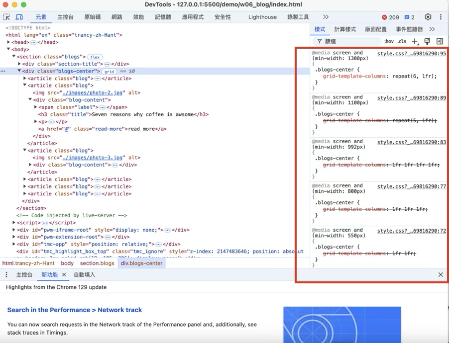

```
2244799 Zihyin  Thu Oct 24 19:39:22 2024 +0800  W07-P2: Redo W06-P4 with breakpoints being cancelled
```
### W07-P3: Connect your Github repo to Vercel and have a root home page to class demo navigation
#### => In Vercel, show w06 blogs demo

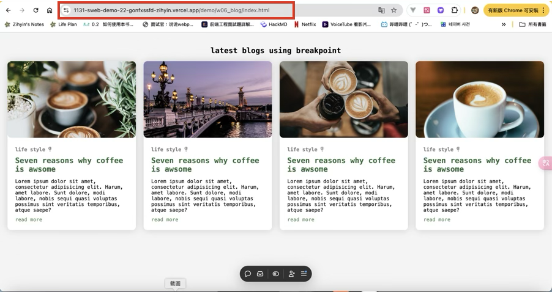
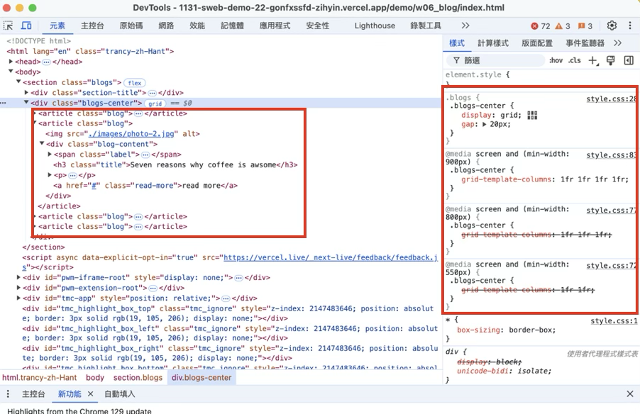

#### => Show your Github repo with Vercel URL

[My Vercel URL](https://1131-sweb-demo-22.vercel.app/)

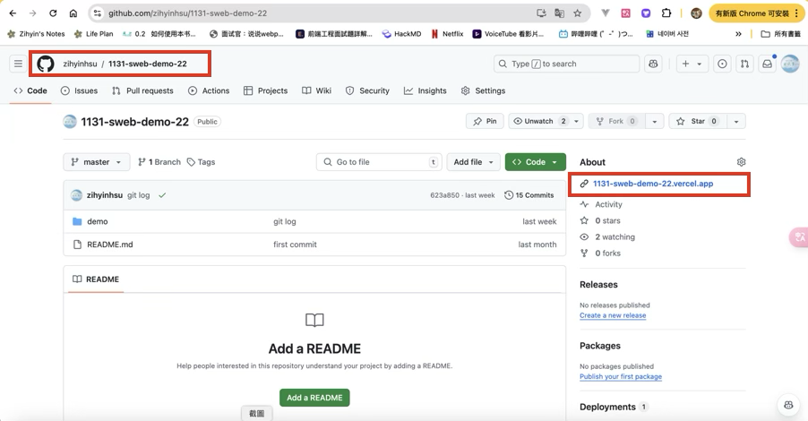

#### => create index.html as root home page and have a link to class demo navigation as done in w07
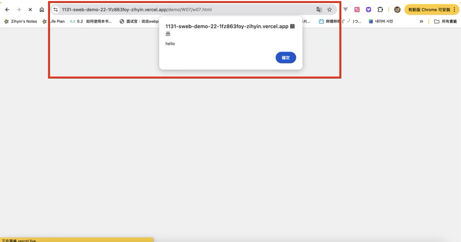
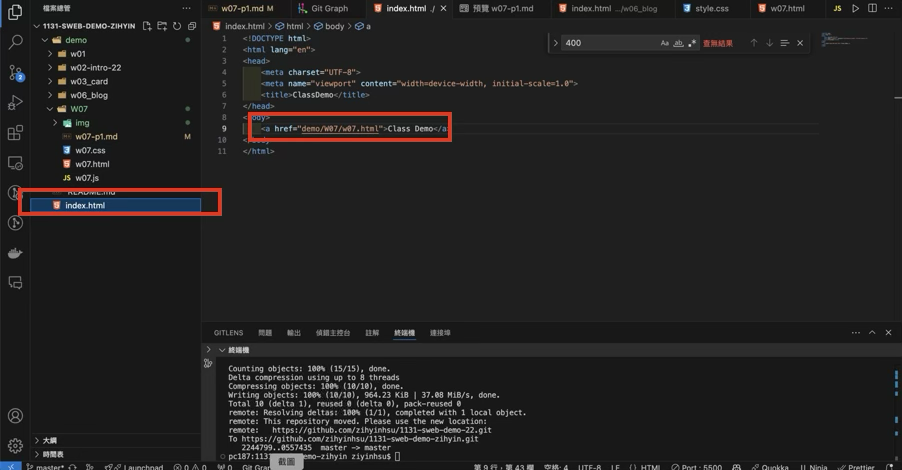
```
46a51ec Zihyin  Thu Oct 24 19:53:57 2024 +0800  W07-P3: Connect your Github repo to Vercel and have a root home page to class demo navigation
```

### W07-P4: Create navbar with links to class demo w02, w03, w06, and deploy it to Vercel

#### => local
 
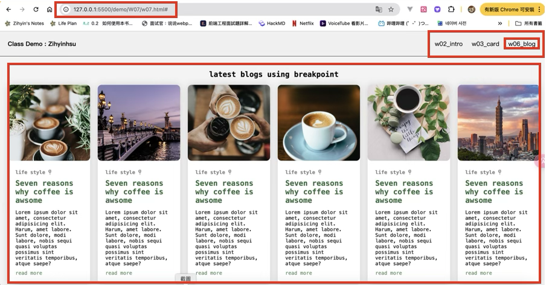

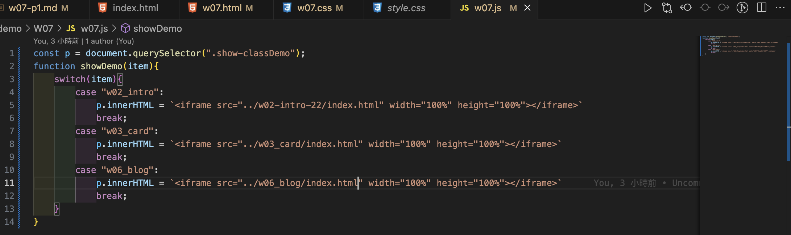

#### => Vercel

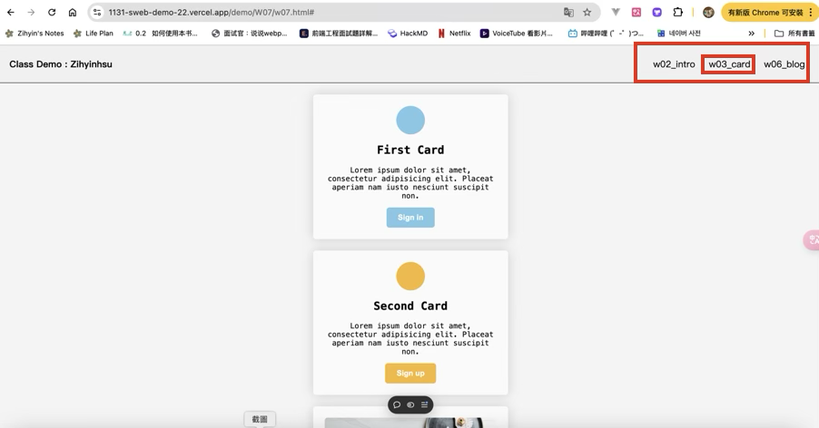

```
7d16124 Zihyin  Thu Oct 24 23:29:03 2024 +0800  Create navbar with links to class demo w02, w03, w06, and deploy it to Vercel
```