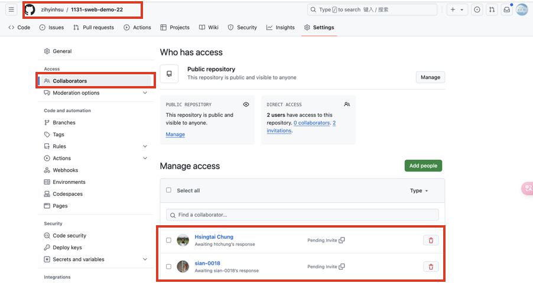
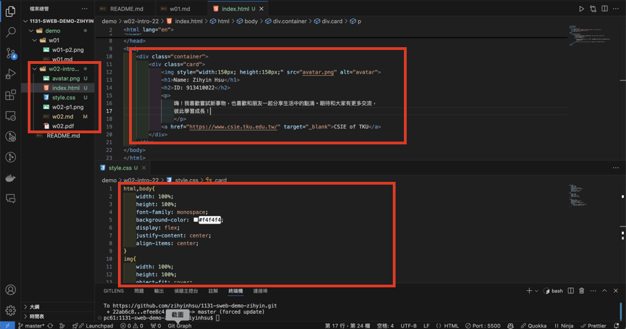
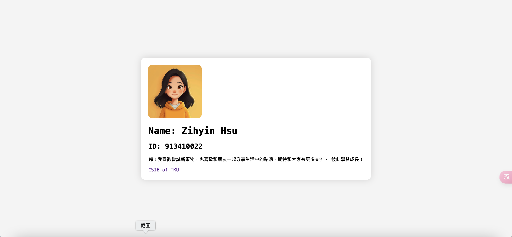

[My Github URL](https://github.com/zihyinhsu/1131-sweb-demo-22)

### W02-P1: Collaborate your Github repo to htchung@gms.tku.edu.tw and sian-0018 (TA)



```
efee8c4b Zihyin  Thu Sep 19 19:12:15 2024 +0800  W02-P1: Collaborate your Github repo to htchung@gms.tku.edu.tw and sian-0018 (TA)
```

### W02-P2: My Introduction using html with css selector (container)



```
dd13e79 Zihyin  Thu Sep 19 20:38:24 2024 +0800  W02-P2: My Introduction using html with css selector (container)
```

### W02-P3: git logs of W2

```
dd13e79 Zihyin  Thu Sep 19 20:38:24 2024 +0800  W02-P2: My Introduction using html with css selector (container)
95c2dc4 Zihyin  Thu Sep 19 20:37:09 2024 +0800  feat : W1 md to PDF
efee8c4 Zihyin  Thu Sep 19 19:40:38 2024 +0800  W02-P1: Collaborate your Github repo to htchung@gms.tku.edu.tw and sian-0018 (TA)
2697a2d Zihyin  Thu Sep 19 19:40:30 2024 +0800  W01-P2 : Show demo/md/w01 files
```