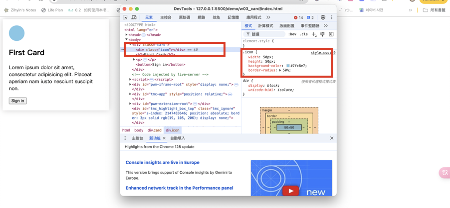
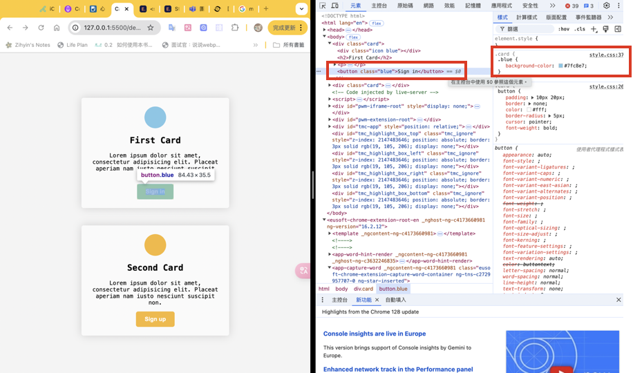
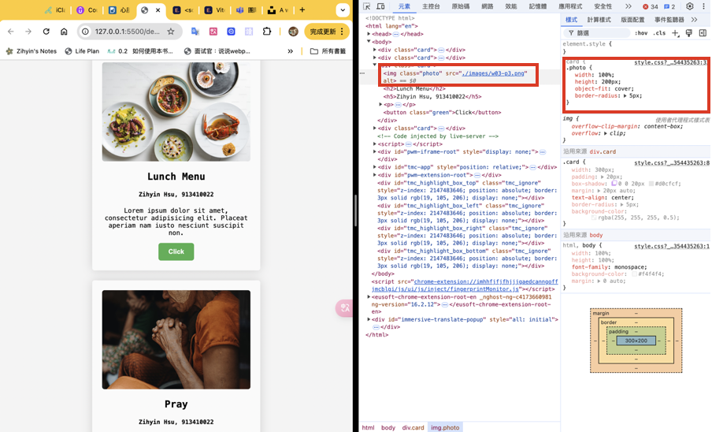

[My Github URL](https://github.com/zihyinhsu/1131-sweb-demo-22)

### W03-P1: Show first card and change icon color using DevTools.


```
0f82f27 Zihyin  Thu Sep 26 19:10:37 2024 +0800  W03-P1: Show first card and change icon color using DevTools.
```

### W03-P2: Show btn and btn-1 class selector in DevTools compare to that in HTML and CSS


```
a132c4a Zihyin  Thu Sep 26 20:13:43 2024 +0800  Show btn and btn-1 class selector in DevTools compare to that in HTML and CSS
```

### W03-P3: Show 2 photos with the same height, remain photo ration, and show .img class selector


```
0db4e20 Zihyin  Thu Sep 26 20:49:41 2024 +0800  W03-P3: Show 2 photos with the same height, remain photo ration, and show .img class selector
```
### W03-P4: git logs

```
0db4e20 Zihyin  Thu Sep 26 20:49:41 2024 +0800  W03-P3: Show 2 photos with the same height, remain photo ration, and show .img class selector
a132c4a Zihyin  Thu Sep 26 20:13:43 2024 +0800  Show btn and btn-1 class selector in DevTools compare to that in HTML and CSS
0f82f27 Zihyin  Thu Sep 26 19:10:37 2024 +0800  W03-P1: Show first card and change icon color using DevTools.
```
