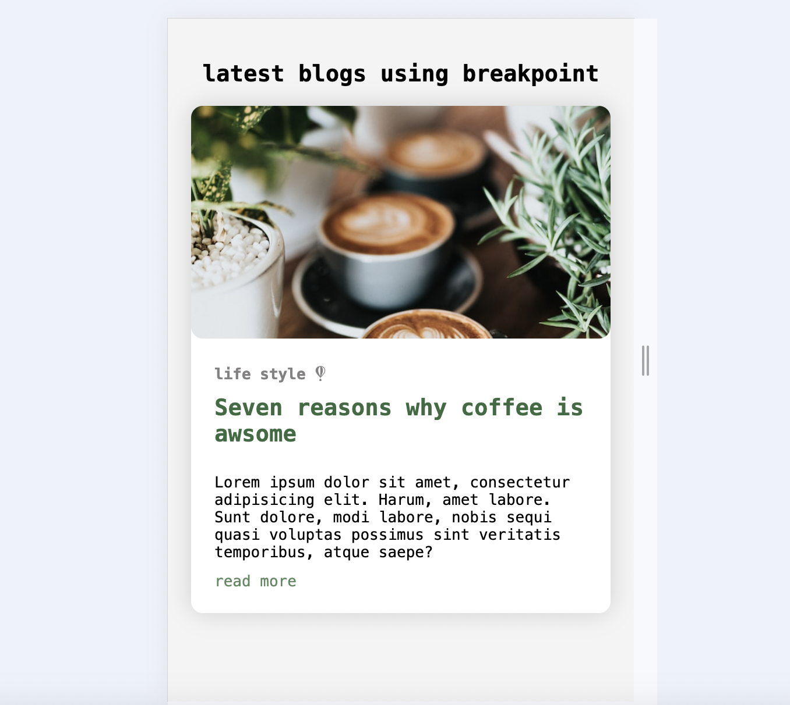
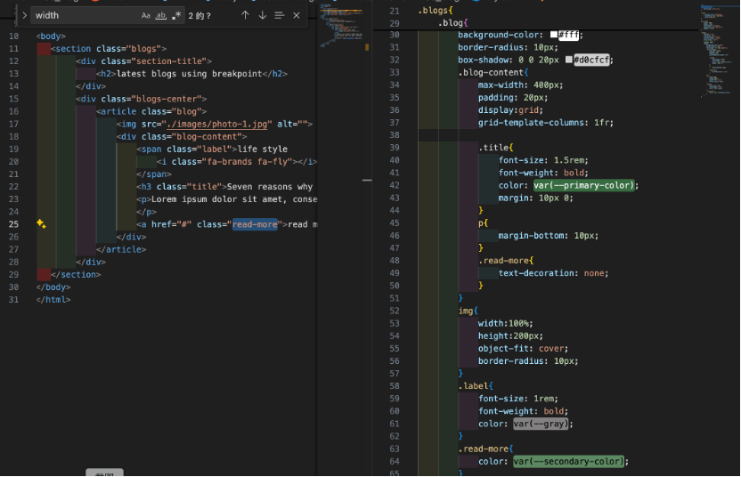
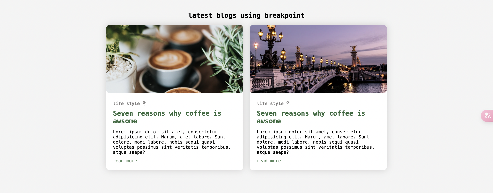
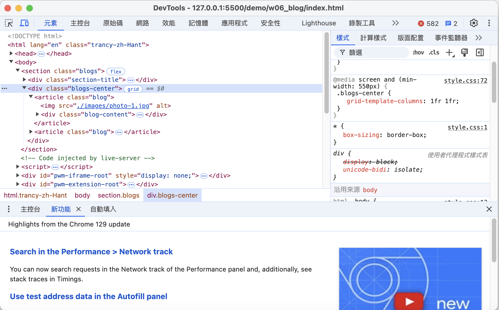
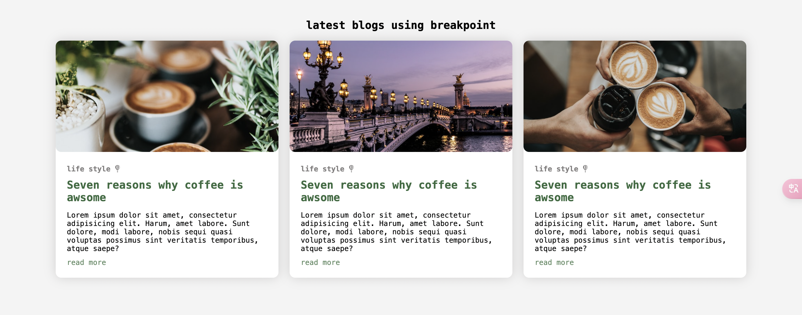
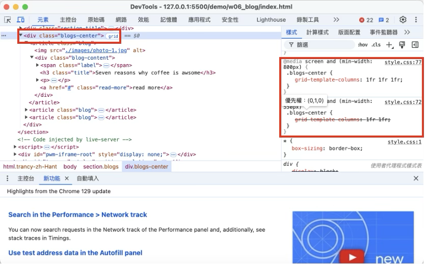
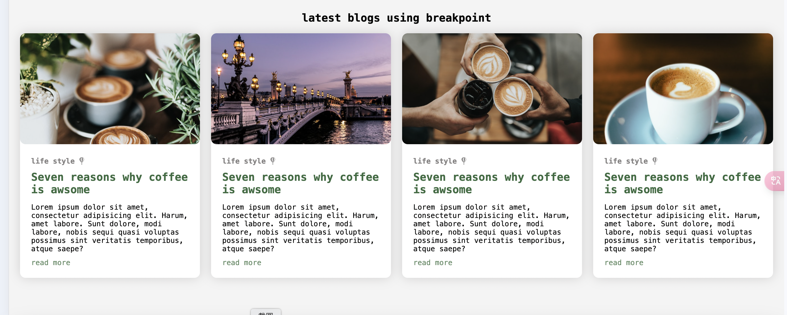
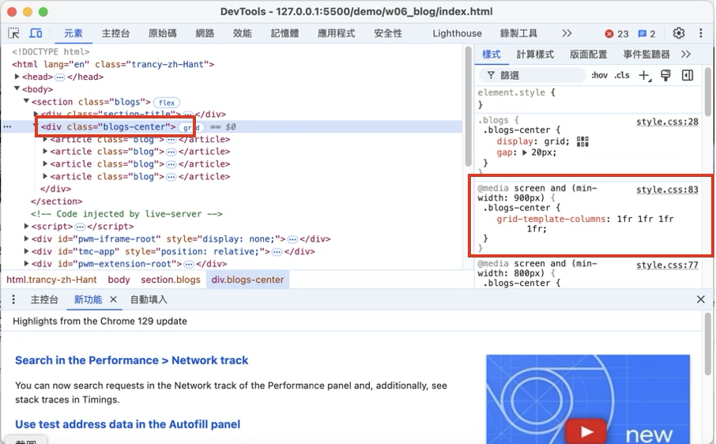
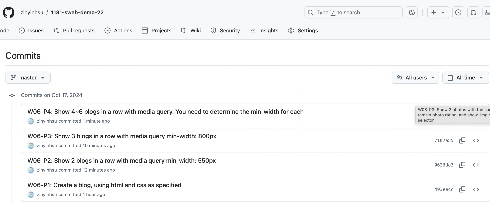

[My Github URL](https://github.com/zihyinhsu/1131-sweb-demo-22)

### W06-P1: Create a blog, using html and css as specified




```
493eecc Zihyin  Thu Oct 17 20:00:37 2024 +0800  W06-P1: Create a blog, using html and css as specified
```
### W06-P2: Show 2 blogs in a row with media query min-width: 550px



```
0623da3 Zihyin  Thu Oct 17 21:31:43 2024 +0800  W06-P2: Show 2 blogs in a row with media query min-width: 550px
```
### W06-P3: Show 3 blogs in a row with media query min-width: 800px



```
7107a55 Zihyin  Thu Oct 17 21:33:23 2024 +0800  W06-P3: Show 3 blogs in a row with media query min-width: 800px
```
### W06-P4: Show 4~6 blogs in a row with media query. You need to determine the min-width for each



```
1f1998f Zihyin  Thu Oct 17 21:42:39 2024 +0800  W06-P4: Show 4~6 blogs in a row with media query. You need to determine the min-width for each
```

