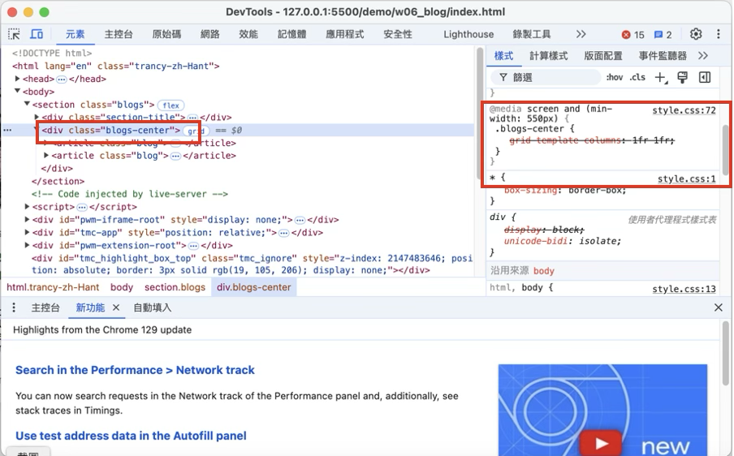

[My Github URL](https://github.com/zihyinhsu/1131-sweb-demo-22)

### W06-P1: Create a blog, using html and css as specified


```
493eecc Zihyin  Thu Oct 17 20:00:37 2024 +0800  W06-P1: Create a blog, using html and css as specified
```
### W06-P2: Show 2 blogs in a row with media query min-width: 550px



```
```
### W06-P3: Show 3 blogs in a row with media query min-width: 800px


```
```
### W06-P4: Show 4~6 blogs in a row with media query. You need to determine the min-width for each

```
```