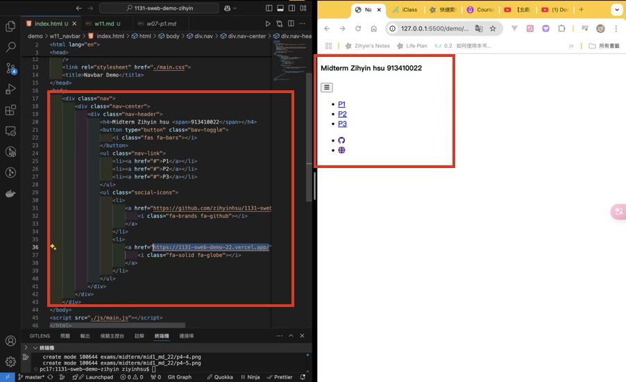
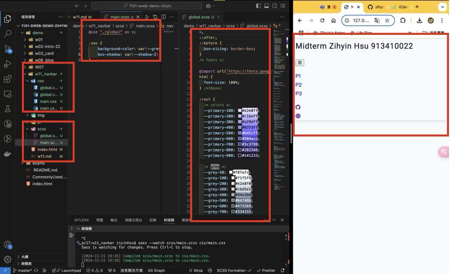
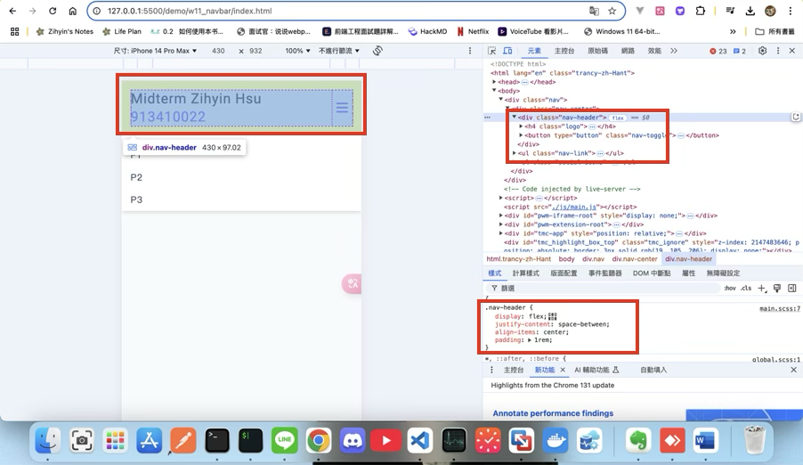
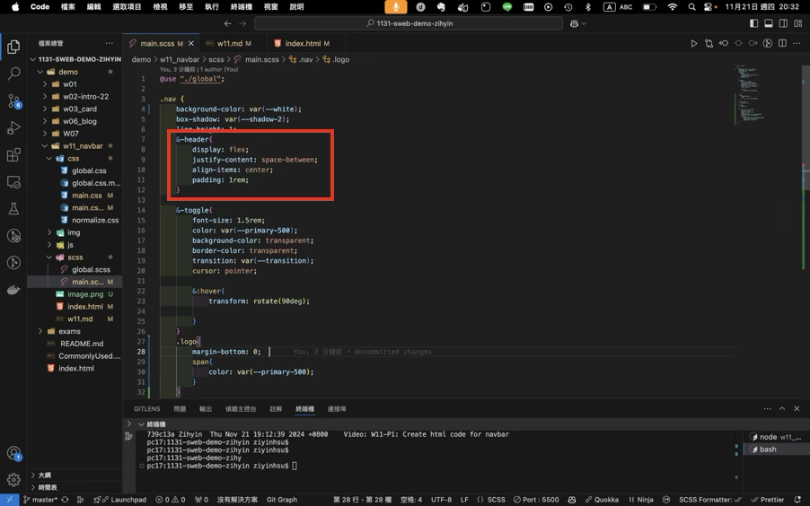
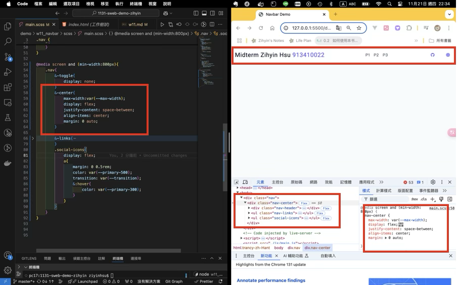

[My Github URL](https://github.com/zihyinhsu/1131-sweb-demo-22)

[My Vercel URL](https://1131-sweb-demo-22.vercel.app/)

### Video: W11-P1: Create html code for navbar


```
739c13a Zihyin  Thu Nov 21 19:12:39 2024 +0800  Video: W11-P1: Create html code for navbar`q
```

### W11-P2: Use sass to convert scss/main_xx.scss to css/main_xx.css



```
c5c42c3 Zihyin  Thu Nov 21 20:09:51 2024 +0800    W11-P2: Use sass to convert scss/main_xx.scss to css/main_xx.css
```

### Video: W11-P3: scss for small screen




```
c2b333a Zihyin  Thu Nov 21 21:02:21 2024 +0800  W11-P3: scss for small screen
```

### Video: W11-P4: css for larger screen



```
ceccd10 Zihyin  Thu Nov 21 22:37:03 2024 +0800  Video: W11-P4: css for larger screen
```
