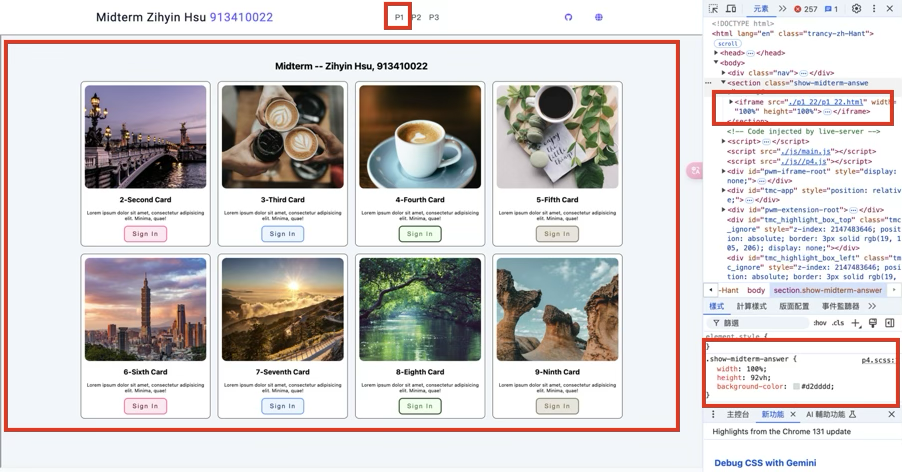
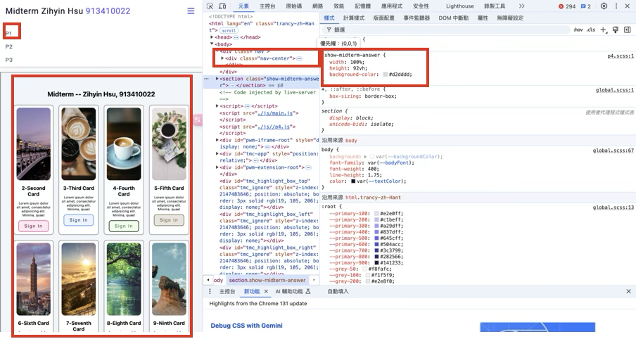
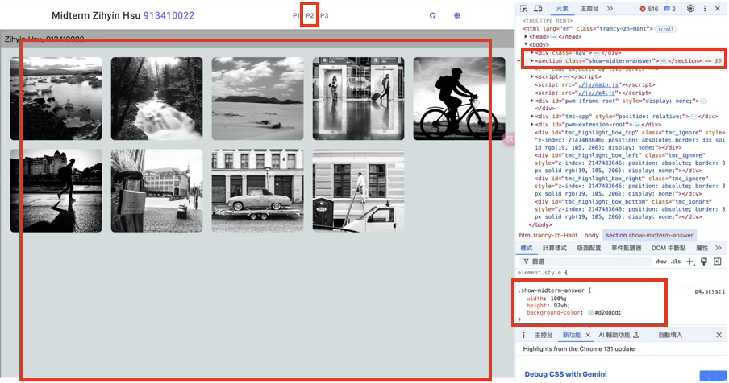
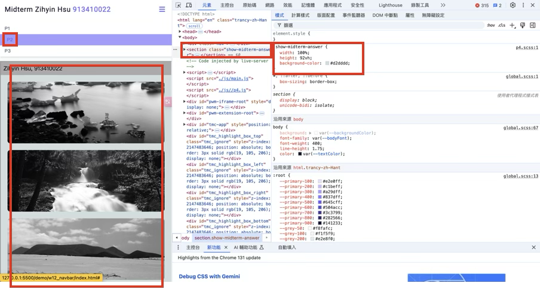
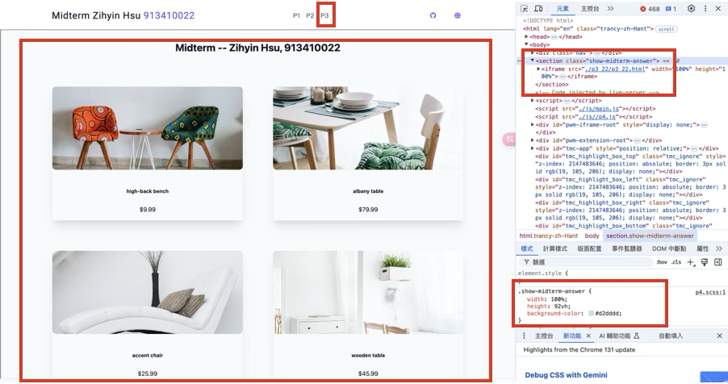
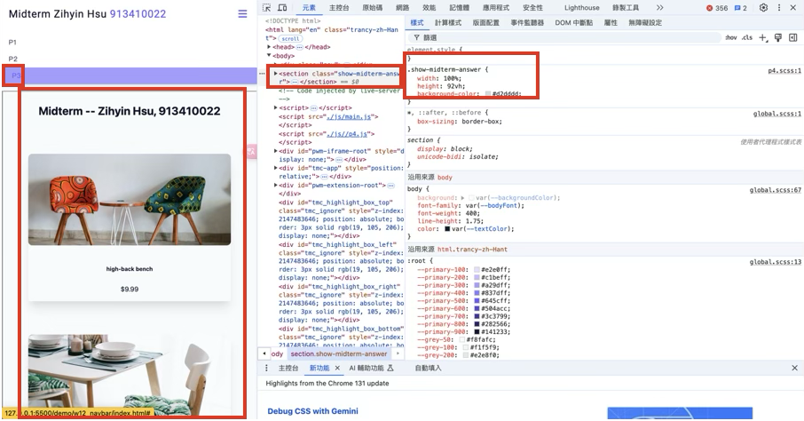
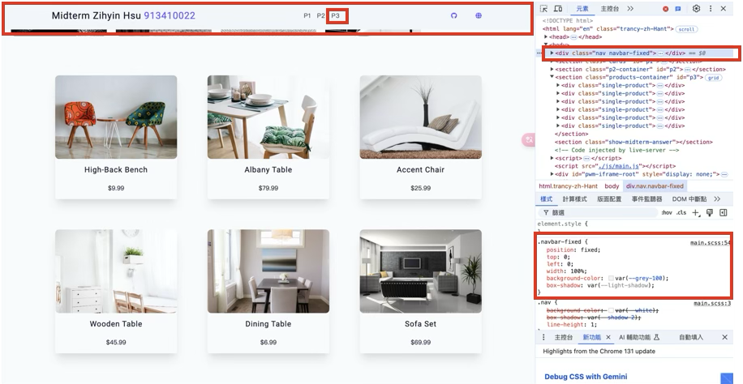
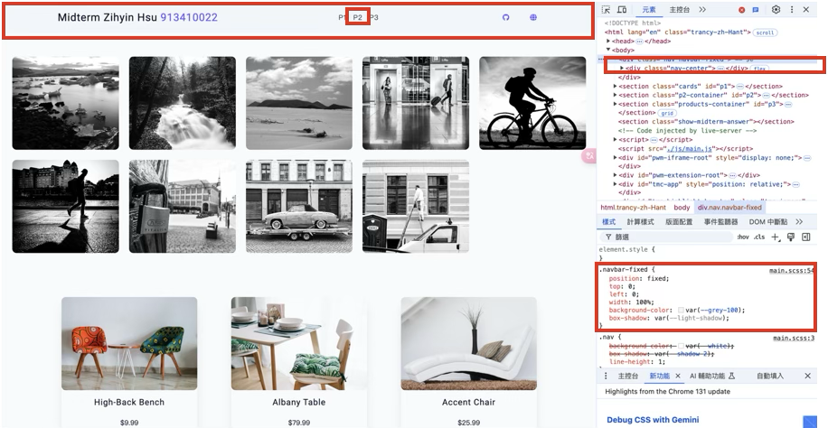

[My Github URL](https://github.com/zihyinhsu/1131-sweb-demo-22)

[My Vercel URL](https://1131-sweb-demo-22.vercel.app/)


### W12-P1: Show annser of p1_xx, p2_xx, p3_xx in midterm exam:
#### => show p1_xx




#### => show p2_xx



#### => show p3_xx



```
a437fbf Zihyin  Thu Nov 28 19:39:36 2024 +0800  W12-P1: Show annser of p1_xx, p2_xx, p3_xx in midterm exam
```


### W12-P2: Embed p1_xx, p2_xx, p3_xx content into index.html, and make it to work correctly
 
#### => select p3_xx nav link, navbar-fixed will be displayed
 

 
#### => select p1_xx nav link, navbar-fixed will be removed


 
#### => select p2_xx nav link, navbar-fixed will be displayed
 


```
cd26f86 Zihyin  Thu Nov 28 20:35:21 2024 +0800  W12-P2: Embed p1_xx, p2_xx, p3_xx content into index.html, and make it to work correctly
```