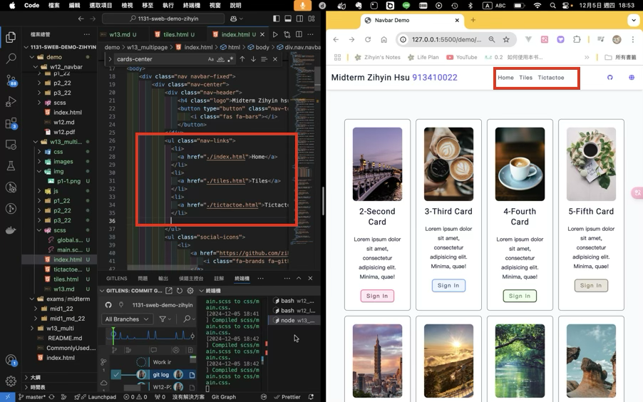

[My Github URL](https://github.com/zihyinhsu/1131-sweb-demo-22)

[My Vercel URL](https://1131-sweb-demo-22.vercel.app/)


### W13-P1: Create tiles_xx.html and tictactoe_xx.htmml with the same navbar as in index.html



```
aab1276 Zihyin  Thu Dec 5 19:25:48 2024 +0800   W13-P1: Create tiles_xx.html and tictactoe_xx.htmml with the same navbar as in index.html
```

### W13-P2: Make tiles_xx.html work using tiles_xx.scss


```
c690617 Zihyin  Thu Dec 5 19:34:09 2024 +0800   W13-P2: Make tiles_xx.html work using tiles_xx.scss
```

### W13-P3: Make tictactoe_xx.html work using tictactoe_xx.scss


```
9878145 Zihyin  Thu Dec 5 20:55:00 2024 +0800   W13-P3: Make tictactoe_xx.html work using tictactoe_xx.scss
```