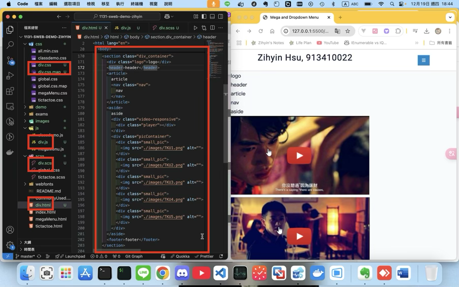
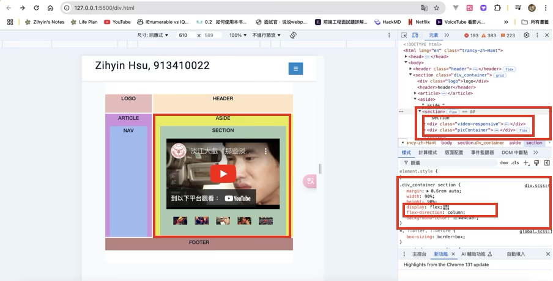
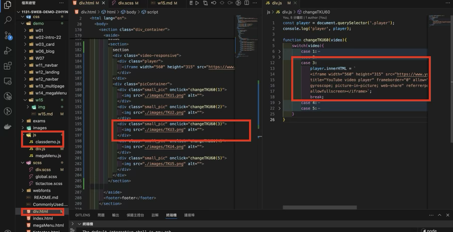
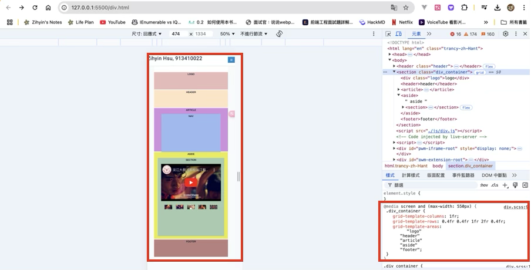
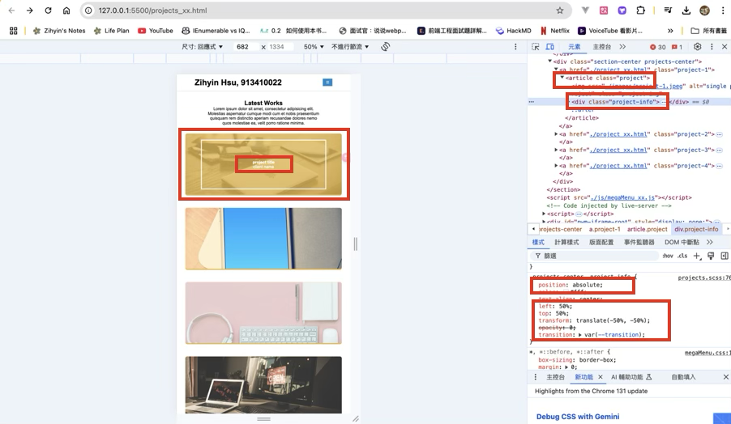
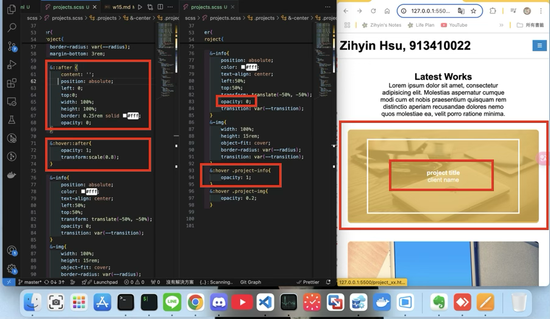

[My Github URL](https://github.com/zihyinhsu/1131-sweb-demo-22)

[My Vercel URL](https://1131-sweb-demo-22.vercel.app/)

### W15-P1: Setup div_xx.html, div_xx.scss, div_tku60_xx.js



```
7fe6262 Zihyin  Thu Dec 19 18:49:28 2024 +0800      W15-P1: Setup div_xx.html, div_xx.scss, div_tku60_xx.js
```
### W15-P2: Show div_xx.html correctly
 
#### => select tku60 pic 3, and show relevant youtube video



#### => html, and js code for showing video 3



```
c53a3d9 Zihyin  Thu Dec 19 20:03:32 2024 +0800  W15-P2: Show div_xx.html correctly
```

### W15-P3: make P2 div_xx.html responsive
 


```
0f7770f Zihyin  Thu Dec 19 20:34:18 2024 +0800  W15-P3: make P2 div_xx.html responsive
```

### W15-P4: show absolute positioning in project_xx.html
 

 


```
060bcd6 Zihyin  Thu Dec 19 21:40:39 2024 +0800  W15-P4: show absolute positioning in project_xx.html
```
