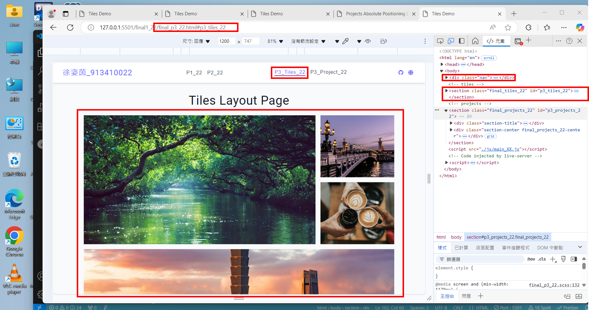
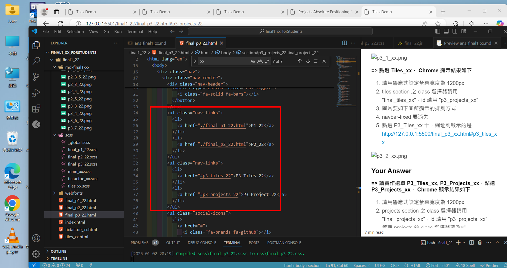

# (60%) 靜態網頁 期末考 1 -- 斷網考試

##### 2025-1-2, at E201, 18:20 ~ 20:50

#### Note:

1. 請不要發揮同學愛，作弊雙方除了本次考試 0 分外，平常分數另扣 20 分，情節嚴重者會送校。
2. iClass 上請繳交 ans_final1_xx.pdf，還有 final1_xx.zip，共 2 個檔案，如果 final1_xx.zip 檔案超過 iClass 之限制 (15MB)，壓縮前請先刪除 images, webfonts, demo 等目錄
3. 請直接將答案寫在 md_final1_xx/ans_final1_xx.md 上，老師出題及圖片放在 ans_final1_htc.pdf 上，請依照老師所給的圖片來實作並標註
4. 跟期末考相關的檔案及目錄名稱有 xx 時，必須要改成學號後 2 碼，沒有修改時，會視違犯情況扣分。
5. 每一張圖片要有機房左側背景，圖片上要有你的學號(或後兩碼)，圖片標註要跟老師所標註的類似。違者會依情節扣分。
6. 請自評分數，將每一題的 ? 填入分數，沒有填者，不會批改，以 0 分計算。
7. (Name, ID): (?, ?) 問號處要填入姓名及學號

##### Your (Name, ID): (徐姿茵, 913410022)

- P1 (18%): 18 分
- P2 (18%): 18 分
- P3 (18%): 18 分
- P4 (6%): 6 分

##### 總分: 60 分

---

#### 請以老師在本考試提供的 code 來實作，包含 nav，不要以小考 2 之 nav 來作答，有題目會將 小考 2 老師提供的解答，放入本題來回答。

#### (18%) P1: 請實作 final_p1_xx.html 要能顯示如下圖

1. 請實作 P1_xx, P2_xx 選項
2. scss 請放入 scss/final_p1_xx.scss 中，要用 scss 來產生 css。如果和之前上課 demo 或小考 2 的 css 有衝到，請修改 final_p1_xx.html 之 class 名稱，及相對應 final_p1_xx.scss，以避免衝突。
3. js 請放入 js/final_xx.js 中 (本次期末考所出題目，有用到 js 的部分，請全部放入 final_xx.js 中)

##### => Chrome 顯示結果如下圖

##### => 顯示 P1 使用到的檔案

##### => html 中請用 final_player 來顯示淡江大戲的圖片，切換圖片的 function 是 final_showTKU60(num)，如下圖所示

#### Your Answer

##### => 顯示 Chrome 結果，如上圖

##### => 顯示 P1 使用到的 html，如上圖，其中 nav-links 要展開

##### => 顯示 final_p1_xx.scss 中 final_div_container_xx 選擇器相關的 scss，請標註跟 css grid 有關，你所修改的重點 code

##### => 顯示切換淡江大戲圖片相關的 html 及 js code

---

#### (18%) P2: 請以老師所給的 final_p2_xx.html 來實作，得到如下圖的結果，細節說明如下：

1. scss 請放入 scss/final_p2_xx.scss 中，要用 scss 來產生 css。如果和之前上課 demo 或小考 2 的 css 有衝到，請修改 final_p2_xx.html 之 class 名稱，及相對應 final_p2_xx.scss，以避免衝突。
2. js 請放入 js/final_xx.js 中
3. 本題之 css 可以用 css grid, 也可以用 flex box

##### => 顯示 Chrome 結果，3 個 price plans 全部顯示在同一列上

##### => 請作響應式，當 min-width 小於 800px 時，每列僅顯示一個 price plan，截圖請顯示最後一個 price plan，如老師之截圖

#### Your Answer

##### => 顯示 Chrome 結果，如上圖

##### => 顯示 min-width: 800 以上(含)，3 個 price plan 都顯示在同一行上的所有 scss

##### => 顯示 min-width: 800 以下，一行僅顯示 1 個 price plan 的 scss

---

#### (18%) P3: 請以老師所給的 final_p3_xx.html 來實作，得到如下圖的結果，細節說明如下：

1. 可以參考小考 2 老師提供的答案相關的 code，來實作本題，但本題的選單不可以用小考 2 的選單
2. scss 請放入 scss/final_p3_xx.scss 中，要用 scss 來產生 css。如果和之前上課 demo 或小考 2 的 css 有衝到，請修改 final_p3_xx.html 之 class 名稱，及相對應 final_p3_xx.scss，以避免衝突。

##### => 請實作選單 P3_Tiles_xx, P3_Projects_xx，點選 P3_Projects_xx， Chrome 顯示結果如下

1. 請用響應式設定螢幕寬度為 1200px
2. projects section 之 class 選擇器請用 "final_projects_xx"，id 請用 "p3_projects_xx"，管理 projects 的 class 選擇器要改成 "final_projects-center"
3. 圖片要如下圖所顯示的排列方式
4. navbar-fixed 要能顯示
5. 點選 P3_Projects_xx 十，網址列顯示的是
   http://127.0.0.1:5500/final_p3_xx.html#p3_projects_xx

##### => 點選 Tiles_xx， Chrome 顯示結果如下

1. 請用響應式設定螢幕寬度為 1200px
2. tiles section 之 class 選擇器請用 "final_tiles_xx"，id 請用 "p3_projects_xx"
3. 圖片要如下圖所顯示的排列方式
4. navbar-fixed 要消失
5. 點選 P3_Tiles_xx 十，網址列顯示的是
   http://127.0.0.1:5500/final_p3_xx.html#p3_tiles_xx

#### Your Answer

##### => 請實作選單 P3_Tiles_xx, P3_Projects_xx，點選 P3_Projects_xx， Chrome 顯示結果如下

1. 請用響應式設定螢幕寬度為 1200px
2. projects section 之 class 選擇器請用 "final_projects_xx"，id 請用 "p3_projects_xx"，管理 projects 的 class 選擇器要改成 "final_projects-center"
3. 圖片要如下圖所顯示的排列方式
4. navbar-fixed 要能顯示
5. 點選 P3_Projects_xx 十，網址列顯示的是
   http://127.0.0.1:5500/final_p3_xx.html#p3_projects_xx

##### => 實作 P3_Projects_xx 有修改過的相關的 html, css

##### => 點選 Tiles_xx， Chrome 顯示結果如下

1. 請用響應式設定螢幕寬度為 1200px
2. tiles section 之 class 選擇器請用 "final_tiles_xx"，id 請用 "p3_projects_xx"
3. 圖片要如下圖所顯示的排列方式
4. navbar-fixed 要消失
5. 點選 P3_Tiles_xx 十，網址列顯示的是
   http://127.0.0.1:5500/final_p3_xx.html#p3_tiles_xx

##### => 實作 P3_Tiles_xx 有修改過的相關的 html, css

---

#### (6%) P4: 建立所有選項， P1_xx, P2_xx, P3_Tiles_xx, P3_Projects_xx 之間的超連結，都要正常能夠執行

#### Your Answer

##### => 請顯示 html 相關的 code

