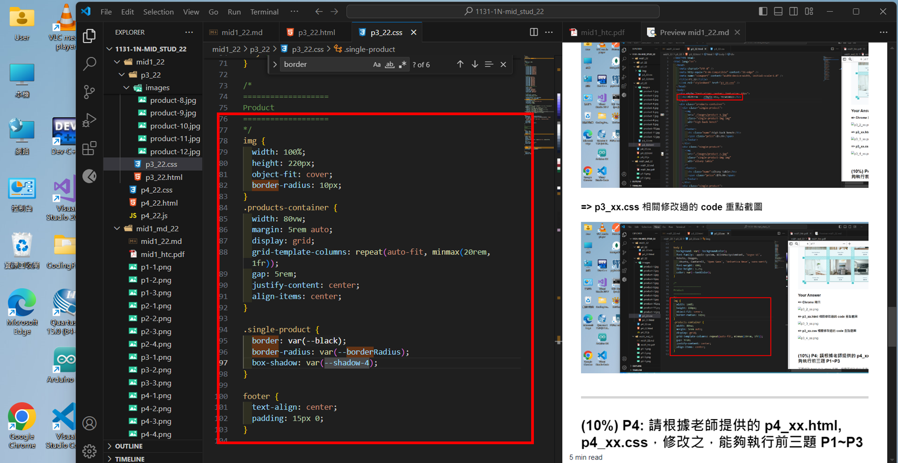

# (60%) 靜態網頁小考 -- 斷網考試

##### 2024-11-14, at E201

#### Note:

1. 請不要發揮同學愛，作弊雙方除了本次考試 0 分外，平常分數另扣 20 分，情節嚴重者會送校。
2. iClass 上請繳交 mid1_xx.pdf，還有 mid1_xx.zip 兩個檔案。
3. 請直接將答案寫在 mid1_xx.md 上，老師出題及圖片放在 mid1_htc.pdf 上，請依照老師所給的圖片來實作並標註
4. 跟期中考相關的檔案及目錄名稱有 xx 時，必須要改成學號後 2 碼，沒有修改時，會視違犯情況扣分。
5. 每一張圖片要有機房左側背景，圖片上要有你的學號(或後兩碼)，圖片標註要跟老師所標註的類似。違者會依情節扣分。
6. 請自評分數，將每一題的 ? 填入分數，沒有填者，不會批改，以 0 分計算。

##### Your (Name, ID): (徐姿茵, 913410022)

##### 題目及配分

- P1 (10%): 10 分
- P2 (20%): 20 分
- P3 (20%): 20 分
- P4 (10%): 10 分

##### 總分: 60 分

---

### (10%) P1: 請根據老師所提供的 p1_xx.html, p1_xx.css 修改之，加入第四個色系，並完成下圖。請依下面步驟一一將之完成。

取圖片的順序，從你的學號最後一碼，往下取兩張圖片，如果走到底，再從頭開始取，學號最後一碼最後一碼為 0 者，直接從 1 取。在 title 前加入所取圖片最後一個數字。

本題老師採用學號最後一碼是 7 來顯示，每個同學有可能不同，請注意。

第四個色系變數資料如下

```
: root {
  --card-4-color: #7c6a40;
  --card-4-background: #e8e4db;
  --card-4-border: 2px solid #8a8578;
}
```


#### Your Answer

##### => Chrome 顯示


##### => p1_22.html 相關修改過的 code 重點截圖


##### => p1_22.css 相關修改過的 code 重點截圖

## 

### (20%) P2: 請用老師提供的 p2_xx.html 及 p2_xx.css，修改之提供下列響應式的輸出

##### => 當螢幕寬度介於 640px~767px，一行顯示 2 張卡片


##### => 當螢幕寬度介於 768px~1023px，一行顯示 3 張卡片


##### => 當螢幕寬度介於 1024px~1279px，一行顯示 4 張卡片


##### => 當螢幕寬度介於 1280px~1534px，一行顯示 5 張卡片


#### Your Answer

##### => 當螢幕寬度介於 640px~767px，一行顯示 2 張卡片


##### => 當螢幕寬度介於 768px~1023px，一行顯示 3 張卡片


##### => 當螢幕寬度介於 1024px~1279px，一行顯示 4 張卡片


##### => 當螢幕寬度介於 1280px~1534px，一行顯示 5 張卡片


---

### (20%) P3: 請根據老師提供的 p3_22.html, p3_22.css 修改之，以完成下圖。


#### Your Answer

##### => Chrome 顯示


##### => p3_xx.html 相關修改過的 code 重點截圖


##### => p3_xx.css 相關修改過的 code 重點截圖



---

### (10%) P4: 請根據老師提供的 p4_xx.html, p4_xx.css，修改之，能夠執行前三題 P1~P3

不要修改 html 中之 class 名稱，但需要修改你的名字及學號，需修改 p4_xx.css, p4_xx.js，能夠成功執行 p1_xx.html, p2_xx.html, p3_xx.html，並顯示老師已經設定好的 show-midterm-answer 區塊中。

##### => Chrome 顯示 p1_xx.html 結果


#### Your Answer

##### => Chrome 顯示 p1_xx.html 結果


##### => Chrome 顯示 p2_xx.html 結果


##### => Chrome 顯示 p3_xx.html 結果


##### => p4_xx.css, p4_xx.js 重點截圖


